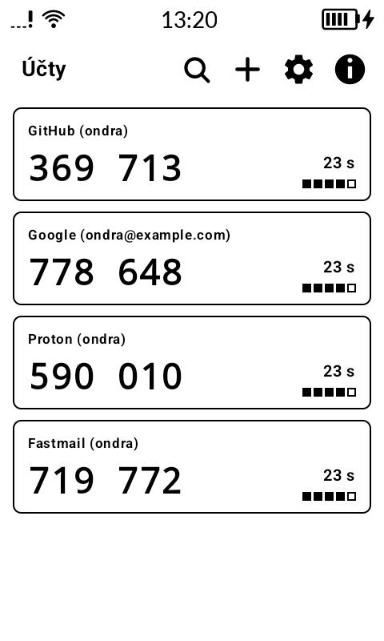
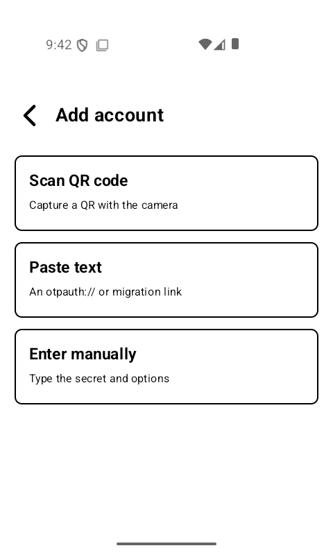
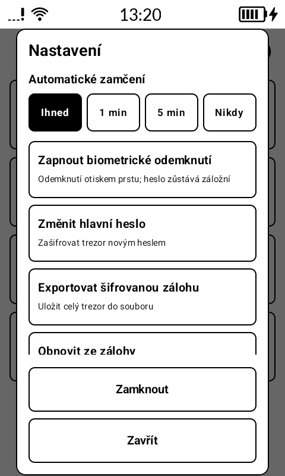

# kAuth

A minimal **TOTP/HOTP two-factor authenticator** for the [Mudita Kompakt](https://mudita.com/products/phones/mudita-kompakt/),
part of the `k*` family of e-ink-first apps. It generates the usual 6/8-digit
one-time codes, imports accounts from Google Authenticator, and keeps every
secret in a vault encrypted with a master password.

Designed around e-ink from the first line: a forced light theme, no animations,
sharp borders instead of shadows, large monospace codes, and a plain numeric
countdown instead of an animated ring. Fully offline — no network, no Google
Services, no tracking.

[](https://www.buymeacoffee.com/ok1cdj)

<p>
  
  
  
</p>

## Features

- **RFC 6238 (TOTP) and RFC 4226 (HOTP)** with HMAC-SHA1/SHA256/SHA512,
  configurable digits (6/8) and period. The whole OTP engine lives in a pure-JVM
  `:core` module tested against the official RFC test vectors.
- **Add an account three ways:** manual entry, an `otpauth://` link (pasted or
  scanned), or a **single-shot QR capture** (no continuous viewfinder — that
  would ghost the e-ink panel), decoded with ZXing.
- **Robust Google Authenticator import** (`otpauth-migration://`). The payload is
  decoded from scratch per the public field spec; a malformed account in a batch
  is reported and skipped instead of crashing the import, and multi-part exports
  are scanned part by part with a final added/failed summary.
- **Password-encrypted vault.** Secrets are encrypted with AES-256-GCM under a
  key derived from your master password with **Argon2id**. The password is asked
  on every launch and is never stored.
- **Optional biometric unlock.** A fingerprint can unlock the vault by unwrapping
  the same key from the Android Keystore; the master password stays the ultimate
  key and always works as a fallback. (Shown only on devices with biometrics.)
- **Auto-lock** on leaving the foreground — immediate by default, or after 1/5
  minutes, or never.
- **Edit the issuer** of an existing account (tap an account → Edit) — handy
  when a scanned or imported account has a missing or unhelpful issuer.
- **Search/filter** for long account lists.
- **Encrypted backup** to a single file (same Argon2id / AES-256-GCM as the live
  vault), restorable with the master password. This is the only backup path —
  there is no cloud sync.
- **Screenshot / screen-capture prevention** (`FLAG_SECURE`).
- English and Czech, following the device language.

## Security model

kAuth uses envelope encryption: a random **vault master key (VMK)** encrypts the
account data with AES-256-GCM, and the VMK is wrapped by a key derived from your
master password with Argon2id (per-vault random salt, parameters stored with the
vault). Biometric unlock adds a second, device-local wrap of the *same* VMK with
an Android Keystore key — so enabling or disabling it, and changing your password,
never re-encrypt or migrate the vault.

**There is no password recovery.** If you forget the master password, the vault
cannot be decrypted — by anyone, including you. Keep an encrypted backup and
remember the password. The plaintext password and decrypted secrets live only in
memory while the app is unlocked.

## Architecture

```
kAuth/
├── core/   Pure Kotlin/JVM — no Android. Unit-tested without an emulator.
│           Base32, HOTP/TOTP, otpauth:// parsing, otpauth-migration decoding,
│           the vault crypto (Argon2id + AES-256-GCM) and password strength.
└── app/    Jetpack Compose UI + MMD (Mudita Mindful Design) e-ink components.
            Preferences DataStore for the encrypted vault blob, CameraX for the
            one-shot QR capture, SAF for encrypted backup export/restore.
```

## Build & install

Requires JDK 17+ and the Android SDK (compileSdk 37).

```bash
./gradlew assembleDebug        # debug build
./gradlew :core:test           # RFC vectors, migration decoding, vault round-trip
```

### Release signing

Release builds are signed with a keystore referenced from `local.properties`
(gitignored). Copy the template, generate a keystore once with `keytool`, then:

```bash
cp local.properties.example local.properties   # fill in signing.*
scripts/build-release.sh                        # -> kauth-<versionName>.apk
```

Pushing a `v*` tag builds a signed APK in GitHub Actions and attaches it to a
GitHub Release (secrets: `KEYSTORE_BASE64`, `KEYSTORE_PASSWORD`, `KEY_ALIAS`,
`KEY_PASSWORD`).

## Out of scope (permanently)

Cloud sync; importing from other authenticators' on-device databases (root);
dark theme; in-app language switch. The only ways in are QR/URI import and
restoring your own encrypted backup.

## License

GPL-3.0. See [LICENSE](LICENSE) and the in-app About dialog.
